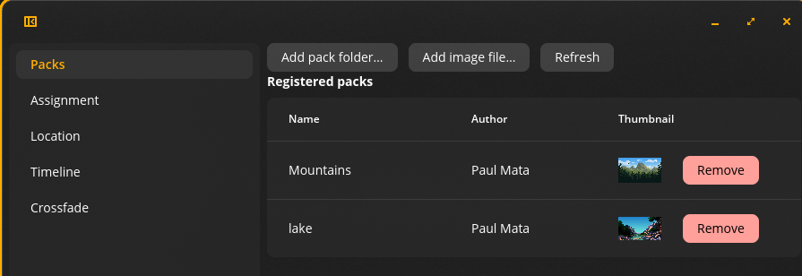

# Cosmic Dynamic Wallpaper

A from-scratch, COSMIC-native dynamic wallpaper daemon for the [COSMIC desktop
environment](https://github.com/pop-os/cosmic-epoch). It rotates wallpapers across the day
following real solar events (sunrise, sunset, civil/astronomical twilight, solar noon) for
your location - or a fully custom, location-free manual schedule - and crossfades smoothly
between images instead of hard-cutting.

## Why

Several desktops already do time-of-day wallpapers - macOS's Dynamic Desktop, Windows'
WinDynamicDesktop, GNOME's slideshow XML format, Cinnamon's **Dynamic Wallpaper** extension (which was the true inspiration behind this project).
COSMIC doesn't have an equivalent yet: `cosmic-bg`'s slideshow feature only supports dumb
fixed-interval rotation through an unordered image list, with no concept of time-of-day or a
smooth transition between images.

This project differs from prior art in three ways:

- **Smooth GPU crossfade** between images at each transition, not a hard cut
- **Astronomically-anchored periods** (civil/astronomical twilight, solar noon), not just
  raw sunrise/sunset with evenly-spaced slots
- **Native libcosmic UI and `cosmic-config` persistence**, not a bolted-on toolkit

## Features

- Wallpapers change automatically across the day, following either real solar events for your location or a fully custom manual schedule
- Easily manage image packs from the GUI
  - Add/Remove packs
  - Assign packs
- Transitions between images are visually smooth (crossfade), not jarring
- Works correctly across mixed multi-monitor, multi-scale-factor setups
- Feels like a native part of COSMIC - install, configure, and forget
- Idle cost (when no transition is happening) is effectively zero

## Screenshots



The **Packs** page of `cosmic-wallpaper-settings` — add a pack folder or single image,
remove one, and see each pack's author and thumbnail at a glance.

## Future goals

- Update the pack configuration from the GUI
- A curated wallpaper marketplace
- Weather-reactive imagery
- Parsing Apple's `.heic` dynamic-wallpaper metadata format directly

## Installing

### Download a release (recommended)

Pre-built `.deb` packages are published on this repository's
**[Releases page](https://github.com/iampaulmata/cosmic-dynamic-wallpaper/releases)**. To
install the latest one:

```sh
# Download the .deb from the Releases page above, then:

sudo apt install ./cosmic-dynamic-wallpaper_*.deb
```

`cosmic-wallpaperd` then autostarts with your COSMIC session via the bundled systemd user unit — every
session *after* the one you installed in. The installer (`postinst`) only enables the unit for
all users (`systemctl --user --global enable`); it deliberately does not try to start it inside
whatever session you happen to already be logged into, since a root-run install script can't
reliably reach a specific logged-in user's session bus. **If you install while already logged
in, log out and back in once (or reboot)** — from then on `cosmic-wallpaperd` starts automatically every
session, registers the bundled starter pack, and actively schedules it, with nothing further to
configure. Launch **Cosmic Dynamic Wallpaper Settings** from your app launcher (or
`cosmic-wallpaper-settings` from a terminal) to browse packs, change assignment/location/
crossfade settings, or use `cosmic-wallpaperctl --help` for the CLI equivalent.

### Build from source

```sh
git clone https://github.com/iampaulmata/cosmic-dynamic-wallpaper.git
cd cosmic-dynamic-wallpaper
cargo build --release --workspace
cargo deb -p renderer          # produces target/debian/*.deb
sudo apt install ./target/debian/*.deb
```

See [`packaging/`](packaging/) and `specs/005-session-integration-packaging/quickstart.md`
for the full packaging walkthrough, and each crate's own README under `crates/` for its
individual build/toolchain requirements (e.g. `crates/renderer/README.md`'s
`libxkbcommon-dev` note).

## Contributing

This project is still in early development and is not yet open for contributions.

## License

GPL-3.0-only.
