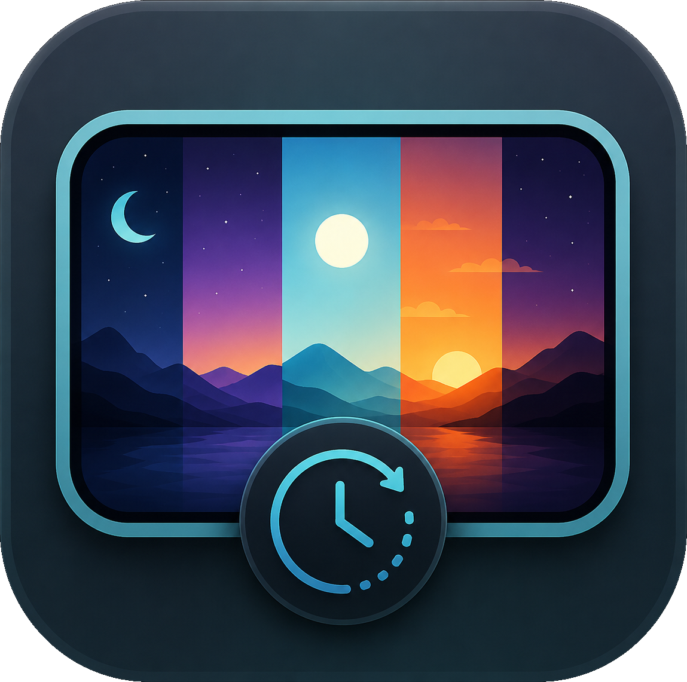

# Cosmic Dynamic Wallpaper

<p align="center">
  
</p>

**A dynamic wallpaper changer for the COSMIC desktop environment.** Automatically change your COSMIC Desktop wallpaper throughout the day using real solar events such as sunrise, sunset, civil twilight, astronomical twilight, and solar noon — or create your own custom wallpaper schedule. Smooth GPU-powered crossfade transitions make each wallpaper change seamless.

[](https://github.com/pop-os/cosmic-epoch)
[](LICENSE)

**Cosmic Dynamic Wallpaper** is a COSMIC-native **Linux wallpaper changer, dynamic wallpaper manager, and time-of-day wallpaper system** built specifically for the COSMIC desktop environment.

If you're looking for a **wallpaper changer for COSMIC Desktop**, a **COSMIC dynamic wallpaper**, a **COSMIC wallpaper slideshow**, or a way to automatically change wallpapers based on the time of day, this project provides those capabilities without relying on a third-party desktop environment extension.

---

## What is Cosmic Dynamic Wallpaper?

Cosmic Dynamic Wallpaper brings automatic, time-aware wallpaper changes to the **COSMIC desktop environment**.

Instead of simply rotating through a list of images at a fixed interval, wallpapers can follow the actual progression of the day at your location:

**Astronomical Twilight → Civil Twilight → Sunrise → Solar Noon → Sunset → Civil Twilight → Astronomical Twilight**

Each period can have its own wallpaper, and transitions between wallpapers use a smooth GPU-accelerated crossfade rather than an abrupt change.

You can also ignore astronomical calculations entirely and create a **custom manual schedule**, making the project useful for any wallpaper rotation workflow.

### In short

- 🌅 **Time-of-day wallpapers** for COSMIC Desktop
- 🌞 **Solar-event scheduling** based on your location
- 🌄 Sunrise and sunset wallpaper changes
- 🌆 Civil and astronomical twilight support
- ☀️ Solar-noon scheduling
- 🕐 Fully customizable manual schedules
- 🖼️ Wallpaper packs for organizing images
- ✨ Smooth GPU-powered crossfade transitions
- 🖥️ Multi-monitor support
- 🖥️ Mixed monitor scale-factor support
- ⚙️ Native COSMIC settings application
- 💻 Command-line control
- 🔋 Essentially zero idle cost when no transition is occurring

---

## Why?

Many desktop environments and operating systems have some form of dynamic wallpaper functionality.

Apple has **Dynamic Desktop** wallpapers. Windows has applications such as **WinDynamicDesktop**. GNOME supports wallpaper slideshow XML files, and Cinnamon has a **Dynamic Wallpaper** extension.

COSMIC Desktop currently has wallpaper and slideshow functionality through `cosmic-bg`, but a traditional slideshow is fundamentally different from a **time-of-day dynamic wallpaper**.

A normal slideshow answers:

> "Change my wallpaper every 30 minutes."

Cosmic Dynamic Wallpaper answers:

> "Change my wallpaper when the sun rises, reaches solar noon, sets, and enters twilight."

This project was created to provide that missing functionality as a **native COSMIC desktop experience**.

### How it differs from a traditional wallpaper slideshow

**Fixed-interval slideshow:**

```text
Wallpaper 1
    ↓ 30 minutes
Wallpaper 2
    ↓ 30 minutes
Wallpaper 3
    ↓ 30 minutes
Wallpaper 4
```

**Cosmic Dynamic Wallpaper:**

```text
Astronomical Twilight
        ↓
Civil Twilight
        ↓
Sunrise
        ↓
Solar Noon
        ↓
Sunset
        ↓
Civil Twilight
        ↓
Astronomical Twilight
```

The schedule follows the actual solar cycle at your location rather than simply advancing an image counter.

---

## Features

### 🌞 Solar-based dynamic wallpapers

Wallpaper changes can be tied to real astronomical events calculated for your configured location.

Supported solar events include:

- Astronomical twilight
- Civil twilight
- Sunrise
- Solar noon
- Sunset

This allows a wallpaper pack to visually evolve throughout the entire day.

---

### 🕐 Custom wallpaper schedules

Don't want to use astronomical calculations?

No problem.

Cosmic Dynamic Wallpaper also supports a **fully custom, location-independent schedule**.

You can define your own times for wallpaper changes, making it suitable for:

- Fixed time-of-day wallpaper rotations
- Workday schedules
- Custom artistic sequences
- Gaming setups
- Seasonal wallpaper packs
- Any other manually defined schedule

---

### ✨ Smooth crossfade transitions

Wallpaper changes aren't hard cuts.

Cosmic Dynamic Wallpaper uses a **GPU-powered crossfade** between images to create a smooth transition from one wallpaper to the next.

This is particularly useful for time-of-day wallpaper packs where the images are designed to transition gradually from one lighting condition to another.

---

### 🖼️ Wallpaper packs

Organize wallpapers into reusable **packs**.

The settings application allows you to:

- Add wallpaper packs
- Remove wallpaper packs
- Assign wallpaper packs
- View pack thumbnails
- View pack author information

A pack can contain the complete sequence of images needed to represent an entire day.

---

## Screenshots

### Wallpaper Packs

The **Packs** page of `cosmic-wallpaper-settings` allows you to manage registered wallpaper packs, add new packs, remove existing packs, and view their metadata.


---

## COSMIC Desktop integration

Cosmic Dynamic Wallpaper is designed specifically for the **COSMIC desktop environment** rather than being a generic Linux wallpaper utility.

The project consists of native COSMIC components and integrates with the COSMIC configuration system.

It uses:

- **libcosmic** for the graphical settings application
- **cosmic-config** for persistent configuration
- A dedicated wallpaper daemon
- A COSMIC session systemd user service
- A command-line control interface

The primary components are:

```text
cosmic-wallpaperd
        │
        ├── Solar event scheduling
        ├── Wallpaper pack management
        ├── Transition scheduling
        └── GPU rendering
                │
                ▼
        COSMIC Desktop
```

---

## Installation

### Download a release

The easiest way to install Cosmic Dynamic Wallpaper is to download the latest `.deb` package from the **[Releases page](https://github.com/iampaulmata/cosmic-dynamic-wallpaper/releases)**.

Then install it with:

```sh
sudo apt install ./cosmic-dynamic-wallpaper_*.deb
```

After installation, `cosmic-wallpaperd` is configured to start automatically with your COSMIC session through the bundled systemd user unit.

### Important: first installation

If you install the package while already logged into COSMIC, **log out and log back in once** (or reboot).

The installer enables the service globally but deliberately does not attempt to start it inside the currently logged-in user's session. This avoids problems with trying to access a specific user's session bus from a root-run installation script.

After logging back in:

1. `cosmic-wallpaperd` starts automatically.
2. The starter wallpaper pack is registered.
3. Wallpaper scheduling begins automatically.
4. **Cosmic Dynamic Wallpaper Settings** is available from your application launcher.

You can also launch the settings application manually:

```sh
cosmic-wallpaper-settings
```

The command-line interface is available through:

```sh
cosmic-wallpaperctl --help
```

---

## Building from source

Clone the repository:

```sh
git clone https://github.com/iampaulmata/cosmic-dynamic-wallpaper.git
cd cosmic-dynamic-wallpaper
```

Build the complete workspace:

```sh
cargo build --release --workspace
```

Build the Debian package:

```sh
cargo deb -p renderer
```

The resulting packages will be placed in:

```text
target/debian/
```

Install the package:

```sh
sudo apt install ./target/debian/*.deb
```

See [`packaging/`](packaging/) and [`specs/005-session-integration-packaging/quickstart.md`](specs/005-session-integration-packaging/quickstart.md) for the complete packaging and session-integration process.

Individual crates may have additional build dependencies. See the README in each crate for details, including the `libxkbcommon-dev` requirement documented by `crates/renderer/README.md`.

---

## Using Cosmic Dynamic Wallpaper

Once installed, the primary interfaces are:

### Graphical settings

Launch:

```sh
cosmic-wallpaper-settings
```

Use the settings application to:

- Manage wallpaper packs
- Assign wallpaper packs
- Configure your location
- Configure crossfade behavior
- Configure scheduling
- Manage the dynamic wallpaper experience

### Command line

Use:

```sh
cosmic-wallpaperctl --help
```

for available command-line controls.

### Background daemon

The wallpaper scheduling and rendering service is:

```text
cosmic-wallpaperd
```

It runs as a user-level systemd service as part of the COSMIC session.

---

## Wallpaper packs

A wallpaper pack represents a collection of images intended to be used together as a dynamic wallpaper sequence.

For example, a single pack might contain:

```text
night.jpg
astronomical-twilight.jpg
civil-twilight.jpg
sunrise.jpg
morning.jpg
noon.jpg
afternoon.jpg
sunset.jpg
civil-twilight-evening.jpg
night.jpg
```

The scheduler determines which image should be displayed based on the current solar period.

This makes it possible to create highly artistic **time-of-day wallpaper packs** where the desktop visually changes along with the real-world environment.

---

## Multi-monitor support

Cosmic Dynamic Wallpaper is designed to work correctly across multi-monitor configurations, including setups where displays use different scale factors.

This is important for modern COSMIC Desktop installations where users may have combinations such as:

- Laptop + external monitor
- Multiple 1080p monitors
- 4K + 1080p displays
- Mixed fractional scaling
- Different monitor resolutions

---

## Performance

When no wallpaper transition is taking place, the daemon's idle resource usage is **effectively zero**.

Rendering work is primarily performed when a transition is occurring, allowing the wallpaper service to remain lightweight during normal desktop use.

---

## Project architecture

The project is implemented in Rust and organized as a workspace containing the components responsible for wallpaper scheduling, rendering, configuration, and the COSMIC settings interface.

The major pieces include:

```text
cosmic-dynamic-wallpaper
├── cosmic-wallpaperd
│   └── Dynamic wallpaper daemon
│
├── cosmic-wallpaper-settings
│   └── Native COSMIC configuration UI
│
├── cosmic-wallpaperctl
│   └── Command-line interface
│
└── renderer
    └── Wallpaper rendering and transitions
```

See the individual crate README files under [`crates/`](crates/) for implementation-specific information.

---

## Comparison with existing wallpaper solutions

Cosmic Dynamic Wallpaper is specifically designed around **COSMIC Desktop** and time-aware wallpaper scheduling.

| Capability                   | Basic Slideshow | Cosmic Dynamic Wallpaper |
| ---------------------------- | ---------------:| ------------------------:|
| Automatic wallpaper rotation | ✓               | ✓                        |
| Fixed interval rotation      | ✓               | ✓                        |
| COSMIC-native                | ✓               | ✓                        |
| Time-of-day scheduling       | —               | ✓                        |
| Sunrise / sunset             | —               | ✓                        |
| Civil twilight               | —               | ✓                        |
| Astronomical twilight        | —               | ✓                        |
| Solar noon                   | —               | ✓                        |
| Custom schedules             | Limited         | ✓                        |
| Smooth crossfade             | —               | ✓                        |
| Wallpaper packs              | —               | ✓                        |
| Native COSMIC settings UI    | —               | ✓                        |
| Multi-monitor support        | Varies          | ✓                        |

---

## Future goals

Planned or potential future features include:

- **Update wallpaper pack configuration directly from the GUI**
- **Curated wallpaper marketplace**
- **Weather-reactive wallpapers**
- **Direct support for Apple's `.heic` dynamic wallpaper metadata format**

Weather-reactive wallpapers could eventually allow the desktop to respond to conditions such as:

```text
Clear      → Sunny wallpaper
Cloudy     → Overcast wallpaper
Rain       → Rainy wallpaper
Snow       → Snowy wallpaper
Storm      → Storm wallpaper
```

---

## Frequently asked questions

### Does this work with COSMIC Desktop?

Yes. Cosmic Dynamic Wallpaper is specifically designed for the **COSMIC desktop environment**.

### Is this a COSMIC wallpaper changer?

Yes. It provides automatic wallpaper changing for COSMIC Desktop, including fixed custom schedules and solar-event-based scheduling.

### Can COSMIC wallpapers change automatically?

Yes. Cosmic Dynamic Wallpaper can automatically change wallpapers according to sunrise, sunset, twilight, solar noon, or a custom schedule.

### Can I create a COSMIC time-of-day wallpaper?

Yes. Wallpaper packs can be configured to change as the day progresses, using astronomical events calculated for your location.

### Does it support sunrise and sunset wallpapers?

Yes. Sunrise and sunset are supported solar events, along with civil and astronomical twilight and solar noon.

### Does it support multiple monitors?

Yes. The renderer is designed to handle mixed multi-monitor and scale-factor configurations.

### Does it require GNOME, KDE, or Cinnamon?

No. Cosmic Dynamic Wallpaper is built specifically for **COSMIC Desktop** and is not a GNOME Shell extension, KDE Plasma widget, or Cinnamon extension.

### Is it a Wayland wallpaper changer?

It is designed for the Wayland-native COSMIC desktop environment and integrates with COSMIC rather than attempting to emulate the wallpaper behavior of another desktop environment.

---

## Status

Cosmic Dynamic Wallpaper is currently in **early development**.

The project is not yet open for contributions.

---

## License

Cosmic Dynamic Wallpaper is licensed under the **GPL-3.0-only** license.

---

## Keywords

COSMIC Desktop · COSMIC desktop environment · COSMIC wallpaper · COSMIC wallpaper changer · COSMIC dynamic wallpaper · COSMIC desktop wallpaper changer · COSMIC wallpaper slideshow · COSMIC wallpaper rotation · COSMIC time-of-day wallpaper · COSMIC animated wallpaper · COSMIC dynamic desktop · Pop!_OS wallpaper changer · Linux wallpaper changer · Linux dynamic wallpaper · Wayland wallpaper changer · sunrise wallpaper · sunset wallpaper · astronomical wallpaper · solar wallpaper · time-based wallpaper · dynamic desktop wallpaper · wallpaper scheduler · wallpaper automation
